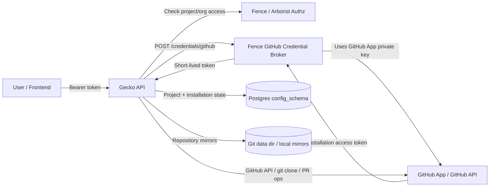
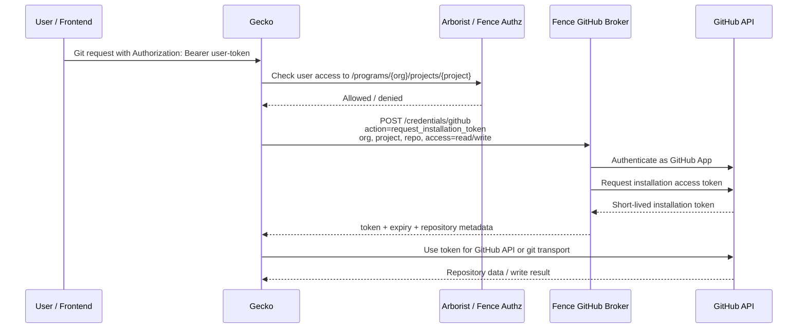
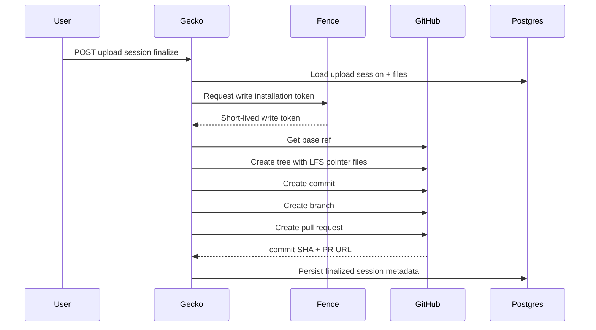
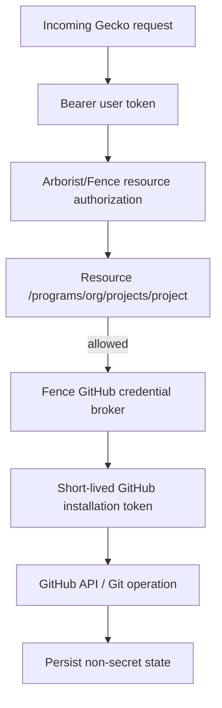
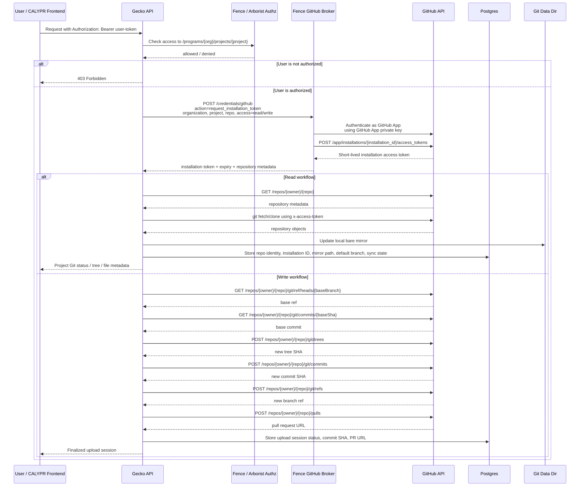

Grounded in PR #4: Gecko now asks Fence for GitHub installation tokens and stores only repository/installation/sync state, not GitHub private keys or tokens.   

# Gecko GitHub Key and Token Architecture

## Summary

Gecko does not mint or store GitHub App private keys directly. Instead, Gecko delegates GitHub App credential brokering to Fence.

The model is:

1. User authenticates to Gecko with a bearer token.
2. Gecko authorizes the user against project or organization resources.
3. Gecko calls Fence at `/credentials/github`.
4. Fence validates the user and GitHub App installation context.
5. Fence returns a short-lived GitHub installation access token.
6. Gecko uses that token immediately for GitHub read/write operations.
7. Gecko persists repository state, installation metadata, mirror paths, sync status, and upload/PR metadata.
8. Gecko should not persist GitHub access tokens or GitHub App private keys.

## Core Components



## Credential Boundaries

### Gecko owns

Gecko owns application-level Git repository orchestration:

* project Git configuration
* project-to-repository mapping
* GitHub installation metadata
* repository mirror path
* default branch
* sync state
* last refresh/error state
* upload sessions
* generated pull request metadata

### Fence owns

Fence owns GitHub App credential brokering:

* GitHub App private key
* GitHub App authentication
* installation token minting
* install URL generation
* installation status checks
* installation repository listing

### GitHub owns

GitHub owns:

* GitHub App installation
* repository permissions
* short-lived installation access tokens
* repository refs, trees, commits, branches, and pull requests

## Token Minting Flow



## Read Token Usage

Read tokens are requested when Gecko needs to:

* refresh a local repository mirror
* read GitHub file metadata
* inspect repository contents
* list refs
* reconcile repository installation status

The token is used as a GitHub installation token, commonly with:

```text
username: x-access-token
password: <installation-token>
```

for Git transport operations.

## Write Token Usage

Write tokens are requested when Gecko needs to create GitHub-side changes, especially upload finalization.

During upload finalization Gecko:

1. validates the upload session
2. confirms all files have DRS object IDs and checksums
3. asks Fence for a write-scoped installation token
4. creates Git LFS pointer files
5. creates a GitHub tree
6. creates a commit
7. creates a branch
8. opens a pull request
9. stores the resulting commit SHA and pull request URL



## What Gecko Stores

Gecko persists Git-related state in Postgres under `config_schema`.

### `git_project_state`

Stores repository and sync metadata:

* `project_id`
* `repo_host`
* `repo_owner`
* `repo_name`
* `installation_id`
* `installation_target_type`
* `installation_target`
* `mirror_path`
* `sync_state`
* `default_branch`
* `last_refreshed_at`
* `last_error`

This table stores installation identity and sync state, not GitHub tokens.

### `git_organization_state`

Stores organization-level installation/configuration state:

* organization installation status
* target metadata
* repository selection
* timestamps
* last error

### `git_upload_session`

Stores staged upload workflow state:

* session ID
* project ID
* base branch
* generated upload branch
* PR title/body
* status
* final commit SHA
* pull request URL

### `git_upload_session_file`

Stores file-level upload state:

* file name
* target path
* size
* checksum
* DRS object ID
* status
* collision/error state

### Local filesystem

Gecko stores local bare mirrors under the configured Git data directory:

```text
{GIT_DATA_DIR}/{host}/{owner}/{repo}.git
```

These mirrors allow Gecko to serve tree, refs, and file metadata without treating GitHub as the only read path.

## What Gecko Should Not Store

Gecko should not persist:

* GitHub App private keys
* GitHub installation access tokens
* GitHub user tokens
* long-lived GitHub credentials
* write tokens after a request completes

The only durable GitHub-related values Gecko should store are identifiers and derived state such as installation ID, repository identity, mirror path, default branch, sync status, commit SHA, and PR URL.

## Security Model



Authorization and GitHub access are separate concerns:

* User authorization decides whether the caller may act on a CALYPR project.
* Fence decides whether that authorized caller may receive GitHub installation access.
* GitHub installation permissions decide what repository actions the token can perform.

Replace the **Security Model** section with this expanded version:

## Security Model



### Key security properties

* Gecko validates the caller’s bearer token before requesting GitHub access.
* Gecko asks Fence for short-lived GitHub installation tokens through `POST /credentials/github`.
* Fence, not Gecko, owns the GitHub App private key and performs token minting.
* Gecko uses GitHub installation tokens only for immediate GitHub API or git transport calls.
* Gecko persists non-secret state only: repository identity, installation ID, mirror path, default branch, sync status, upload session state, commit SHA, and pull request URL.
* Gecko should not persist GitHub App private keys, user tokens, or GitHub installation access tokens.

This reflects the PR’s Fence broker flow and the actual GitHub calls used during read/write workflows.


## Operational Notes

Required runtime configuration includes:

```text
GIT_DATA_DIR
FENCE_BASE_URL
GITHUB_API_BASE_URL
```

`GIT_DATA_DIR` is required for Git-enabled Gecko operation because repository mirrors and thumbnails are filesystem-backed.

## Architecture Decision

Gecko should continue to avoid direct ownership of GitHub App private keys.

Fence should remain the only component responsible for GitHub App key custody and installation token minting. Gecko should request short-lived read/write installation tokens only when needed, use them immediately, and persist only non-secret Git repository lifecycle state.

## Review Checklist

* Confirm no installation tokens are written to Postgres.
* Confirm no GitHub App private key is configured in Gecko.
* Confirm logs do not include installation tokens.
* Confirm write tokens are requested only for write workflows.
* Confirm read tokens are sufficient for mirror refresh and file metadata reads.
* Confirm project authorization happens before token brokerage.
* Confirm organization-level access is checked before install/connect/reconcile flows.
* Confirm stored installation IDs are treated as identifiers, not credentials.

