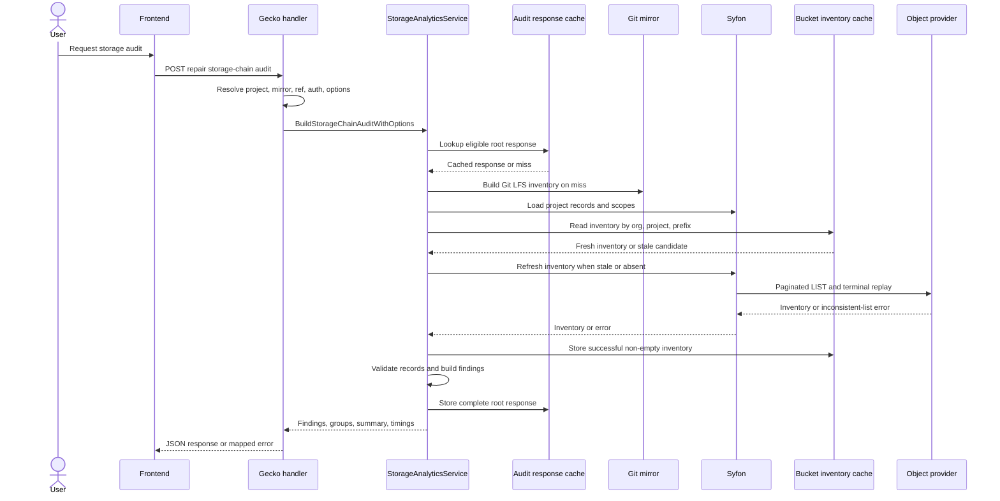
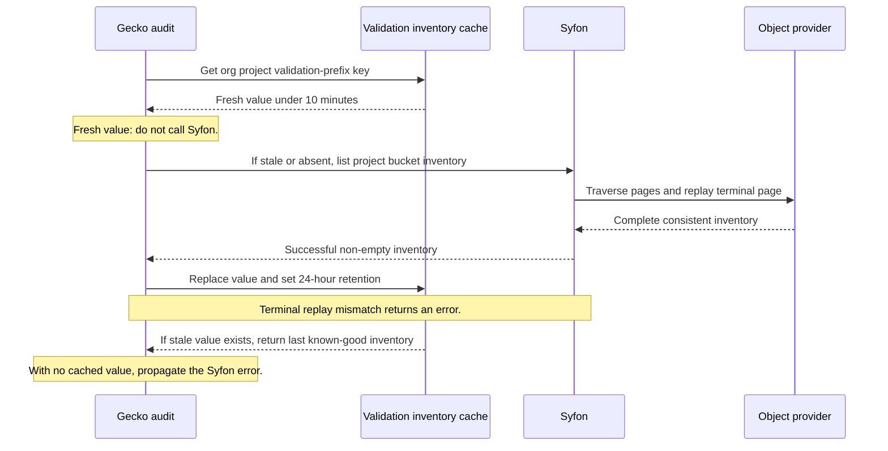

# Gecko storage-chain audit: implementation guide

The storage-chain audit is a read-only cross-check of Git LFS pointers, Syfon project records, project bucket scope mappings, and Syfon bucket inventory. The handler is registered as `POST /api/v1/projects/:project_id/repair/storage-chain/audit` in [`internal/server/http/git/register.go`](../internal/server/http/git/register.go#L54). Repair endpoints are separate.

## Code map

| Responsibility | Owner |
| --- | --- |
| HTTP request parsing, defaults, and error mapping | [`handleGitProjectStorageChainAuditPOST`](../internal/server/http/git/storage_analytics.go#L214-L326) |
| Option normalization and cache selection | [`BuildStorageChainAuditWithOptions`](../internal/git/storage_analytics.go#L481-L539) |
| Root audit-response cache and refresh coalescing | [`buildStorageChainAuditWithResponseCache`](../internal/git/storage_analytics.go#L541-L607), [`coalesceStorageChainAuditRefresh`](../internal/git/storage_chain_audit_cache.go#L49-L76) |
| Fresh audit assembly | [`buildStorageChainAuditFresh`](../internal/git/storage_analytics.go#L646-L723) |
| Parallel Git, record, scope, and bucket input loading | [`loadStorageChainInputs`](../internal/git/storage_analytics_pipeline.go#L75-L180) |
| Syfon record metrics validator and cache | [`loadCachedProjectAuditRecords`](../internal/git/storage_analytics_pipeline.go#L361-L431) |
| Durable bucket inventory cache and stale fallback | [`loadCachedProjectBucketValidationInventory`](../internal/git/storage_analytics_pipeline.go#L519-L566) |
| Validation-mode decision tree | [`buildStorageChainView`](../internal/git/storage_analytics_pipeline.go#L907-L996) |
| Finding model | [`buildStorageChainAuditModel`](../internal/git/storage_analytics_pipeline.go#L1265-L1277) |
| Modes, defaults, and timing implementation | [`storage_analytics_timing.go`](../internal/git/storage_analytics_timing.go#L11-L172) |

## Request contract

The handler resolves auth, project context, Git mirror, ref, and commit, then maps the request to `StorageChainAuditOptions` at [`storage_analytics.go`](../internal/server/http/git/storage_analytics.go#L230-L306).

| Field | Meaning | Default |
| --- | --- | --- |
| `ref` | Git ref to inspect | Project context ref |
| `git_subpath` | Restricts Git findings to one repository path | Root |
| `bucket_inventory_mode` | `validate` uses the project validation inventory; `items` uses explicit bucket items | `validate` |
| `validation_mode` | `list`, `metadata`, or `inventory` | `list` |
| `probe_mode` | Legacy shorthand: `full` selects metadata and `inventory_only` selects inventory when validation mode is omitted | `full` |
| `finding_kind`, `finding_limit` | Response projection only; cache stores the complete model | All / service default |
| `refresh`, `force_audit_refresh`, `force_bucket_inventory_refresh` | Each sets `ForceAuditRefresh` | `false` |

`bucket_path_prefix` is valid only with `bucket_inventory_mode=items` ([handler check](../internal/server/http/git/storage_analytics.go#L275-L280)).

## Request-to-response sequence



The middle arrows are conditional. A fresh response cache skips all input work. A fresh bucket cache skips only the expensive Syfon bucket LIST.

## Cache hierarchy

| Layer | Scope | Forced-refresh behavior |
| --- | --- | --- |
| Audit response cache | org, project, ref, commit hash, Syfon revision, modes, root path | Bypasses the read, rebuilds the full model, then replaces the response |
| Root response projection | Root cached response projected to a Git subpath | Disabled by hard refresh; it reads Git inventory for the selected subpath when used |
| Project record cache | org/project plus Syfon metrics validator | Reloads when record count, latest update, or revision changes |
| Scope and item cache | Short in-process project cache | Normal in-process reuse only |
| Validation inventory cache | org/project/validation prefix | Fresh for 10 minutes; previous good value is retained for 24 hours |

The response cache is eligible only for root Git subpath with no bucket path prefix ([eligibility](../internal/git/storage_analytics.go#L504-L510)). Concurrent root refreshes join one in-flight build, preventing overlapping requests from replacing a completed response ([coalescing](../internal/git/storage_chain_audit_cache.go#L49-L76)).

### Validation inventory cache sequence



Only non-empty successful inventories replace the cache ([store guard](../internal/git/storage_analytics_pipeline.go#L553-L560)). Syfon terminal-page disagreement is an error, never a partial successful response. Gecko returns stale inventory only when a previous good value exists ([fallback](../internal/git/storage_analytics_pipeline.go#L544-L551)). A cold-cache inventory error remains an HTTP error.

## Fresh audit execution

1. `loadStorageChainInputs` starts Git inventory, Syfon records, Syfon scopes, and bucket data concurrently ([lines 100-156](../internal/git/storage_analytics_pipeline.go#L100-L156)).
2. Git, record, and scope errors fail the request. Bucket errors are carried as `bucketInventoryErr`, so validation mode decides whether they are fatal ([lines 158-179](../internal/git/storage_analytics_pipeline.go#L158-L179)).
3. `buildStorageChainView` canonicalizes Syfon record URLs through bucket scopes and attaches list or bulk-probe evidence.
4. `buildStorageChainAuditModel` indexes canonical bucket URLs, Git checksums, and Syfon records, then runs bucket-origin, Syfon-origin, and Git-origin finding passes.
5. Gecko filters and limits only after constructing the complete model. `Groups` use all filtered rows, while `Findings` can be truncated ([response shaping](../internal/git/storage_analytics.go#L703-L722)).

### Validation modes

| Mode | Bucket LIST | Additional Syfon work | Bucket view |
| --- | --- | --- | --- |
| `validate` + `list` | Yes, through durable inventory cache | None | Actual listing; inventory misses are unverifiable |
| `validate` + `metadata` | Skipped | Bulk metadata validation | Synthesized from present probes |
| `validate` + `inventory` | Skipped | None | No bucket list |
| `items` + `list` or `inventory` | Yes, using requested prefix | None | Explicit bucket items |
| `items` + `metadata` | Yes | Probe only records needing confirmation | Listed items plus probe evidence |

The branch is at [`buildStorageChainView`](../internal/git/storage_analytics_pipeline.go#L917-L995). Gecko enables bucket-origin findings only when it has trustworthy list inventory ([decision](../internal/git/storage_analytics.go#L679-L683)).

## Findings and error semantics

The summary keys are initialized in [`newChainSummary`](../internal/git/storage_analytics_pipeline.go#L193-L210).

| Finding kind | Meaning |
| --- | --- |
| `bucket_only_object` | Bucket object has no matching Syfon record or equivalent record identity |
| `bucket_syfon_no_git` | Syfon record resolves to storage but no Git pointer joins it |
| `syfon_missing_bucket_object` | Record storage cannot be resolved from trustworthy list/probe evidence |
| `syfon_git_no_bucket` | Git and Syfon join but storage evidence is missing |
| `git_only_no_syfon` | Git LFS pointer has no Syfon record |
| `git_syfon_metadata_mismatch` | Joined Git, Syfon, and storage metadata conflict |
| `probe_error` | Verification is inconclusive; it is not a missing-object assertion |

For Weka failures, a Syfon traversal error without cached inventory fails the audit. A stale-cache fallback succeeds from older known-good inventory; it must not generate `probe_error` rows from a false empty list.

## Observability and tests

| Log | Meaning |
| --- | --- |
| `syfon_project_bucket_inventory_cache_hit` | Fresh inventory reused |
| `syfon_project_bucket_inventory_cache_store` | Successful non-empty inventory replaced cache |
| `syfon_project_bucket_inventory_cache_stale_fallback` | Syfon refresh failed; stale good inventory used |
| `syfon_project_bucket_inventory_cache_error` | Cache backend failed; Gecko continues direct behavior |
| `storage_chain_audit_request_error` | Handler is returning a mapped audit error |

Stage timings use `storage_chain_audit_stage_start` and `storage_chain_audit_stage_done`; memory snapshots include Git file, Syfon record, and bucket object counts ([timing implementation](../internal/git/storage_analytics_timing.go#L46-L93)).

Run focused coverage from the Gecko repository:

```bash
GOCACHE=/private/tmp/gecko-gocache go test ./internal/git -run 'TestBuildStorageChainAuditForceRefreshBypassesResponseCache|TestProjectBucketInventoryUsesStaleCacheWhenRefreshFails|TestProjectBucketInventoryCacheRetention' -count=1
```

The relevant tests are [`internal/git/storage_analytics_test.go`](../internal/git/storage_analytics_test.go#L2356-L2451) and [`internal/git/storage_chain_audit_cache_test.go`](../internal/git/storage_chain_audit_cache_test.go).
